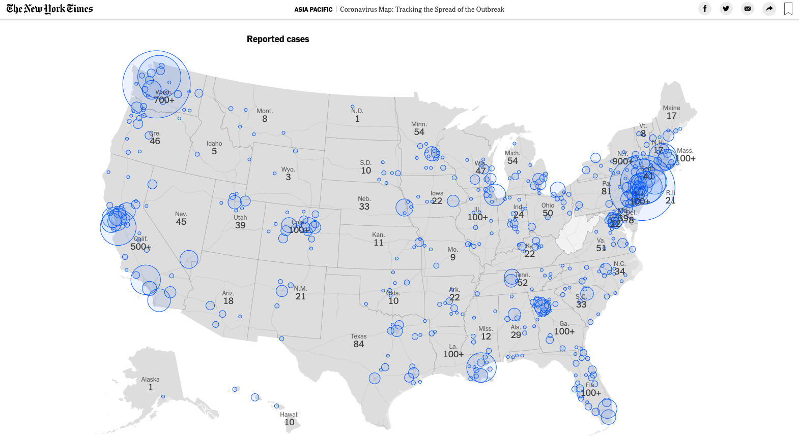

# New York Times coronavirus maps extension

Some us are statistics stalkers, checking the number of coronavirus cases and deaths probably way more than we should. Read [Ellen Peters' piece](https://www.nytimes.com/2020/03/12/opinion/sunday/coronavirus-statistics.html) on this on nytimes.com. 

## A few minor map modifications
This is a Chrome extension to modify the [New York Times coronavirus maps](https://www.nytimes.com/interactive/2020/world/coronavirus-maps.html) to _maybe_ make them a little less anxiety-inducing. The red circle markers are changed to blue, and the background of the map is changed to gray. The number of cases in each U.S. state is also a little big larger.

I'm not a designer, but this made things feel better to me.

## Installation
To install on desktop Chrome, download these files, go to [chrome://extensions/](chrome://extensions/), turn on `Developer mode` in the top right corner, and then either drag the directory onto the extension page, or select the `Load unpacked` button near the top left corner. Browse to the directory of the downloaded files and hit `Select`.

## Support journalism
Also, if you can, [subscribe to the New York Times](http://nytimes.com/subscribe) or other media outlet of your choice. I know that most news services are making their coronovirus coverage free, which is absolutely the right thing to do. But it's also more important than ever to support the independent journalism that keeps us informed.